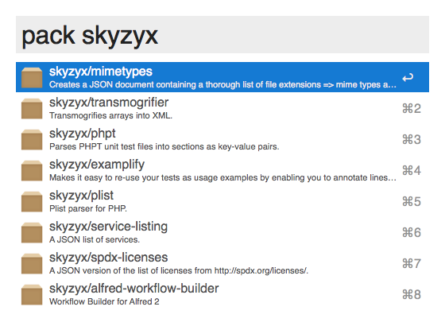

# Alfred 2 workflow for Packagist

<div></div>

**[Download!](https://github.com/skyzyx/packagist.alfredworkflow/raw/master/packagist.alfredworkflow)**
Requires [Alfred 2 and the Powerpack](http://www.alfredapp.com/powerpack/).

Updates can be found and installed using **[Alleyoop](http://alfred.daniel.sh/Workflows/Alleyoop.alfredworkflow)**.

----

## Installation for developers

Are you a developer? Want to hack the code? Here's what you need to know.

1. Download and install Composer.

	```bash
	curl -s "http://getcomposer.org/installer" | php
	```

2. Install your dependencies.

	```bash
	php composer.phar install --optimize-autoloader
	```

3. Make changes, edits and other fixes.

4. Run the build script to remove any non-essential files before exporting the updated workflow from Alfred.

	```bash
	./build.sh
	```
